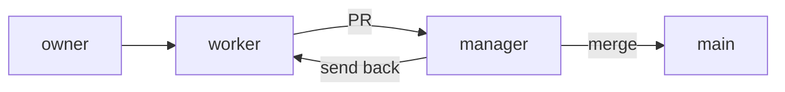

# meeting-minutes

[日本語](README_ja.md) | English

**Turn a recording of a meeting into minutes (Word and Markdown). Everything runs on your own PC; audio, transcription, and summarization are never sent anywhere external.**

<!-- badges: CI badges planned for phase 2 -->

> 🧭 **The requirements and process design decisions here are the author's.** The main ones:
>
> - **The all-local-processing constraint** — designed around the requirement that
>   confidential meeting content never leaves the machine
> - **The worker/manager two-session setup** — separated implementation
>   from independent review/merge authority, and required an independent review
>   from a different vendor (Codex)
> - **The GUI design**
> - **"Auto" mode** — having the LLM suggest a heading structure per video,
>   which can be pinned as a template once you like it
> - **The "Stop" button requirement** — the need to safely interrupt processing that
>   can take tens of minutes
> - **The intermediate-file reuse requirement** — saving transcription, frame
>   extraction, frame analysis, and minutes summarization separately, so a failure or
>   interruption never means starting over from scratch
>
> Implementation was carried out by multiple Claude Code sessions. The roles and
> review criteria are documented in
> [Development process](#development-process-ai-assisted-collaboration).

---

## Background

Meeting minutes are a natural fit for AI automation. But meeting audio and shared
screens often carry customer data or non-public business and HR information, so
many teams cannot send that recording to a cloud transcription/summarization
service. Common constraints:

- NDAs
- Data-protection law
- GDPR
- Internal policy

## Overview

A CLI / GUI tool that takes a single video file and runs the following **entirely locally** to generate minutes.

1. Extract audio from the video (ffmpeg)
2. Transcribe with timestamps (Whisper)
3. Extract frames of screen shares / slides and summarize their content (VLM)
4. Generate minutes from the transcript + frame notes (LLM)

- There is no code that connects to an external domain. The only thing it talks to is a **local LLM server you run yourself** (e.g. [LM Studio](https://lmstudio.ai/)) over `localhost`
- Once the models are downloaded, it **runs to completion even with Wi-Fi turned off** (→ [`docs/privacy_en.md`](docs/privacy_en.md))

Output goes to `output/<video name>/`:

```
output/<video name>/
├─ transcript/
│   ├─ audio.wav              Extracted audio
│   ├─ transcript.json        Timestamped transcript (structured)
│   └─ transcript.txt         Timestamped transcript (readable text)
├─ frames/
│   ├─ *.jpg                  Extracted frames
│   ├─ frames.json            Index of extracted frames (used for resume)
│   └─ frame_notes.json       Per-frame analysis results (used for resume)
├─ work/
│   ├─ minutes_partials.json  Chunk summaries of the minutes (for long transcripts; used for resume)
│   └─ structure_used.txt     Auto-generated heading structure from "Auto" mode (copy into templates/ if you like it; see below)
├─ logs/
│   └─ gui.log                GUI log output (same content as the on-screen log; appended)
├─ minutes.docx               The minutes as a Word file (auto-generated from .md)
└─ minutes.md                 The minutes (organized into decisions / action items+owners / due dates, etc.)
```

This project was developed by running multiple Claude Code sessions (an implementer and a reviewer) in coordination, with a defined division of roles and review process (→ [Development process](#development-process-ai-assisted-collaboration)).

## GUI

<table>
<tr>
<td width="50%"><br>English (default, no <code>--lang</code> flag)</td>
<td width="50%"><br>Japanese (<code>--lang ja</code>)</td>
</tr>
</table>

1. Pick a video and click "Create minutes"
2. Watch transcription → frame analysis → minutes generation proceed, with a progress bar and a log
3. Custom templates ("Choose a file") are supported too

## Setup

Quickstart for macOS / Linux (Windows: see [`docs/setup_en.md`](docs/setup_en.md)):

**macOS:**

```bash
brew install ffmpeg          # required for audio / frame extraction
bash scripts/setup.sh        # creates the virtualenv, installs deps, and fetches the transcription model
cp config.example.toml config.toml
```

**Linux:**

```bash
sudo apt install ffmpeg      # Debian/Ubuntu; other distros use their own package manager. Required for audio / frame extraction
bash scripts/setup.sh        # creates the virtualenv, installs deps, and fetches the transcription model
cp config.example.toml config.toml
```

- `scripts/setup.sh` does the whole setup in one command: create the virtualenv (`.venv`), install dependencies, and fetch the transcription model from HuggingFace. This setup step is the only time the model is downloaded — **the app itself runs fully offline** (`cli.py` / `gui.py` set `HF_HUB_OFFLINE`; if the model is missing at runtime it stops with an error instead of downloading)
- Separately, start **LM Studio** (Settings → Local Models → Local Model API: turn on "Local API server"; "Just-in-time model loading" is also recommended)
- For minutes generation, choose an **Instruct-style model that does not do reasoning (thinking), or can have it turned off** (reasoning models are extremely slow and can return empty bodies → [`docs/models_en.md`](docs/models_en.md))
- For detailed steps, model selection, and troubleshooting, see [`docs/setup_en.md`](docs/setup_en.md) and [`docs/models_en.md`](docs/models_en.md)

## Usage

```bash
python src/meeting_minutes/gui.py                 # GUI: pick a video and click "Create minutes". Shows a progress bar and log
python src/meeting_minutes/gui.py --lang ja       # Show the GUI text in Japanese (default is English)
python src/meeting_minutes/cli.py meeting.mp4      # CLI: for smoke tests / automation
```

- GUI display language priority: `--lang` (that run only) > the `MM_GUI_LANGUAGE`
  environment variable > `config.toml`'s `[gui] language` (`"ja"` / `"en"`) > default `"en"`
- Only the **GUI screen text** changes; the transcription language (`[transcribe] language`) and the minutes' language (`[output] minutes_language`) are configured independently (frame-analysis description language automatically follows the recording's own detected language)

(For developers, `python -m meeting_minutes.gui` / `-m meeting_minutes.cli` also work. In that case, either `cd src` or set `PYTHONPATH=src`.)

## Configuration

Adjust via `config.toml` (if you don't have one yet, copy `config.example.toml` to create it). Main keys:

- `[ai] base_url` — the local server endpoint (for Ollama, `http://localhost:11434/v1`)
- `[ai] llm_model` / `[ai] vlm_model` — the loaded model names
- `[transcribe] backend` — `auto` / `mlx` (Apple GPU) / `faster-whisper`
- `[transcribe] model` — default `large-v3-turbo` (fast, high accuracy) / `large-v3` / `medium` / `small`
- `[frames] interval_sec` / `scene_threshold` / `max_frames` — the granularity and cap for frame extraction
- `[output] template_path` — a custom template that replaces the minutes format (heading structure) (see below)
- `[output] auto_structure` — `true` enables "Auto" mode (auto-generates the heading structure to match the video content; see below)

Each value can also be overridden by an environment variable (`MM_AI_LLM_MODEL`, etc.).

### Choosing the minutes format (heading structure)

The **structure** of the minutes (headings and items) can be chosen in three ways. **Quality rules such as "do not fabricate" always apply regardless of which you choose** (the format is only about structure). The same format is used for both single-pass and split generation.

| Mode | Description |
| --- | --- |
| Built-in (default) | Always the same headings regardless of meeting content (decisions / action items / discussion highlights, etc.). Identical to [`templates/minutes_template_example.txt`](templates/minutes_template_example.txt) |
| Auto | Has the LLM propose the heading structure each time to match the video content (e.g. a group-tour briefing → "Schedule", "What to bring", "Meeting place / time", "Notes") |
| Choose a file | Uses the structure of an external file you prepared, e.g. a client's prescribed format |

- Set the default in `config.toml` (priority: **`auto_structure=true` > `template_path` > built-in**)
- The GUI's "Minutes format" radio buttons switch it **for that run only** (the three options are mutually exclusive; even with `auto_structure=true` in `config.toml`, choosing "Built-in" or "Choose a file" in the GUI wins)

#### Auto (auto-generate to match the video)

Set `[output] auto_structure = true` in `config.toml`, or choose "Auto" in the GUI.

- Using the transcript (chunk summaries for long meetings) as material, the LLM generates **only the heading structure that fits that meeting**, once. It does this within the token budget and **does not crowd the context used to generate the minutes body** (it reuses the existing split summaries and does not read the full text twice)
- The generated structure is saved to **`work/structure_used.txt`** in the output folder, with `{title}` and the like left as placeholders
- If generation fails (LLM error, missing placeholder, a structure too large to fit the merge, etc.), it **falls back to built-in with a warning** (`work/structure_used.txt` is not kept)

**Turn a structure you like into a fixed template** (faster by not having the LLM generate it every time, and the results do not drift):

```sh
cp output/<video name>/work/structure_used.txt templates/<client name>.txt
```

Then set `[output] template_path = "templates/<client name>.txt"` in `config.toml` (or "Choose a file" in the GUI) to pin that structure from then on.

#### Choose a file (custom template)

Use this to match a client's prescribed format.

- Writing a path in `[output] template_path` in `config.toml` makes that file be used every time
- In the GUI, "Choose a file" → "Choose..." to pick the file. Selecting "Built-in (default)" again reverts at any time
- If the file is missing, unreadable, or empty, it **falls back to built-in with a warning**

Placeholders you can use in a template:

| Placeholder | What is substituted |
| --- | --- |
| `{title}` | The video file name (without extension) |
| `{datetime_hint}` | A hint at the date/time ("（記載なし）" / "not stated" if unknown) |
| `{duration_hint}` | A hint at the recording length ("約 N 分" / "about N min", etc.) |
| `{transcript}` | The full transcript (**optional**. If you do not write it in the template, it is appended automatically at the end) |
| `{frames}` | The frame analysis result (with timestamps. **Optional**. Independently of `{transcript}`, only the one you omitted is filled in) |

The starter is [`templates/minutes_template_example.txt`](templates/minutes_template_example.txt) (identical to built-in). Copying it and rewriting the headings is the quick path.

## Limitations and caveats

| Item | Note |
| --- | --- |
| Transcription speed depends on your environment | It varies a lot with machine performance and the model size / backend you pick. See [Configuration](#configuration) for how to choose |
| Transcription accuracy has limits | Mishearings can remain in sections with a lot of singing / BGM / applause, so eyeballing the transcript is recommended for important meetings |
| Progress-bar granularity depends on the backend | With a backend that does not return results incrementally, the progress bar looks stuck and then jumps to the end on completion |
| No speaker labels | There is no "who spoke" label (everything is written as `参加者` / "participant") |
| Minutes generation is for non-reasoning models | Reasoning ("thinking") models are extremely slow and can return an empty body. Use an Instruct model |
| Interruption / resume is at stage boundaries | Intermediate files are reused so only the redone parts re-run (disable with `--fresh` / the GUI checkbox). A stop takes effect after the running stage finishes |
| Settings are edited in the config file | They cannot be changed from the GUI |
| No automatic retry when the LLM times out or drops | Re-run to recover for now |

> 💡 **If you just want to run it, you can stop here.** The rest explains the
> pipeline's internal design (the split via `pipeline.run` / `Deps`) and the
> AI-assisted collaborative development workflow.

## How it works

```
video ─▶ audio extract ─▶ transcribe ─▶ frame extract ─▶ frame analysis(VLM) ─▶ minutes generation(LLM) ─▶ minutes.docx + minutes.md
        (ffmpeg)        (Whisper)         (ffmpeg)         (localhost)             (localhost)
```

- This ordering, progress notifications, and output-directory management are all **consolidated inside `pipeline.run()`**; the GUI, CLI, and tests each call `run()` to use it
- Each stage's implementation is swappable via `pipeline.Deps` (see [`docs/architecture_en.md`](docs/architecture_en.md) for details)

## Design highlights

- **A single seam (`pipeline.run` + `Deps`)** — separates the UI from the real processing. You can test "stage ordering / progress / output paths" without calling ffmpeg or an LLM.
- **LLM/VLM abstracted behind an OpenAI-compatible API** — swappable between LM Studio / Ollama / others by changing `base_url`. No dependency on the `openai` package; calls `httpx` directly.
- **Map-reduce for long transcripts** — a one-hour meeting does not fit in the context window, so it switches to a two-stage chunk-summarize → merge. Summaries are written incrementally to `work/minutes_partials.json`, so a re-run does not redo the finished parts.
- **Per-stage elapsed time shown in the log** — the completion message for audio extraction, transcription, frame extraction, frame analysis, chunk summaries, and the minutes merge each append "elapsed X".
- **Frame analysis is also checkpointed per frame** — `frames/frame_notes.json` is rewritten after each frame finishes, so a mid-way failure does not redo already-analyzed frames.
- **"Waiting for a response" shown during LLM calls** — for stages where the wait is noticeable other than transcription (frame analysis, minutes generation), it is shown together with the model name.
- **Swappable transcription backend** — with `backend=auto`, Apple Silicon uses GPU-backed mlx-whisper and everything else uses faster-whisper. You can also pin it in `config.toml`.
- **Layered configuration** — defaults < `config.toml` < environment variables. TOML is parsed with the standard-library `tomllib`, so there is zero dependency.

For the reasoning behind decisions and their trade-offs, see [`docs/DESIGN_en.md`](docs/DESIGN_en.md).

## Tests

```bash
pip install -r requirements-dev.txt
pytest        # 17 files. Includes integration tests that run ffmpeg (auto-skipped where ffmpeg / an LLM is unavailable)
```

## Development process (AI-assisted collaboration)

This project was implemented by **two role-separated Claude Code sessions** (independent `claude` processes) working together. It applies the idea of **harness engineering** — pairing LLM output with verification and guardrails rather than trusting it outright — to the development process itself.



- **worker** — the session that handles implementation, tests, and git operations
- **manager** — the session that reviews the PRs the worker opens, merges them to `main`
  if clear, or sends them back to the worker if not. Checks before merging:
  - no leaked confidential data (proper nouns from real meetings) in the diff
  - no destructive operations (force push, history rewrite, etc.)
  - `.gitignore` correctly excludes `config.toml` / `output/` etc.
  - the diff stays within the intended scope (no more than the linked Issue/request)
  - manager re-runs pytest and the confidential-data check itself (does not rely on the
    worker's self-report alone)
  - reviews the diff directly
  - independent review by OpenAI Codex (`codex exec review`, a different vendor)
- The division of roles, the prohibitions, and the review criteria are written out in [`.claude/CLAUDE.md`](.claude/CLAUDE.md) (Claude Code loads it automatically at session start; the rest of `.claude/`, such as the operational session log, is private)
- **conversation context is not shared between sessions** — the manager does not see the worker's trial and error, and reviews only from the final diff and report
- **a case where the permission boundary held** — for operations that need the owner's direct confirmation, such as deleting tracked files, the worker did not act on a relay through the manager alone and held work pending the owner's confirmation
- **loop engineering** — rather than a one-shot review, implement → independent verification (pytest, confidential-data check, diff review, Codex review) → send-back → fix → re-verify, repeated until every check is clear
- send-backs are specific — each is returned with the exact location, reproduction conditions, and a fix approach
  - Example: in Auto mode (Issue #34, PRs #19 / #35), more than six token-budget bugs
    surfaced and were fixed over these round trips
  - Example: the problem where the settings frame was invisible on a real screen took
    four rounds (PRs #33 → #40 → #41 → #42) to get right
- **when the same finding recurs, the operational rules are revised** — not just the individual PRs
  - Example: the old-path guard in `.gitignore` was dropped three times in a row across
    PRs #48 / #60 / #66, so "always keep the old-path ignore entry" was then written down as a rule

Because this project handles real meeting data, tracked files are grepped for leaked confidential data before every push / PR.

## Contact

For questions and bug reports, please use [GitHub Issues](https://github.com/satoshi-abe-dev/meeting-minutes/issues).
For security reports, see [SECURITY.md](.github/SECURITY.md).

## License

MIT License. See [LICENSE](LICENSE) for the full text.
