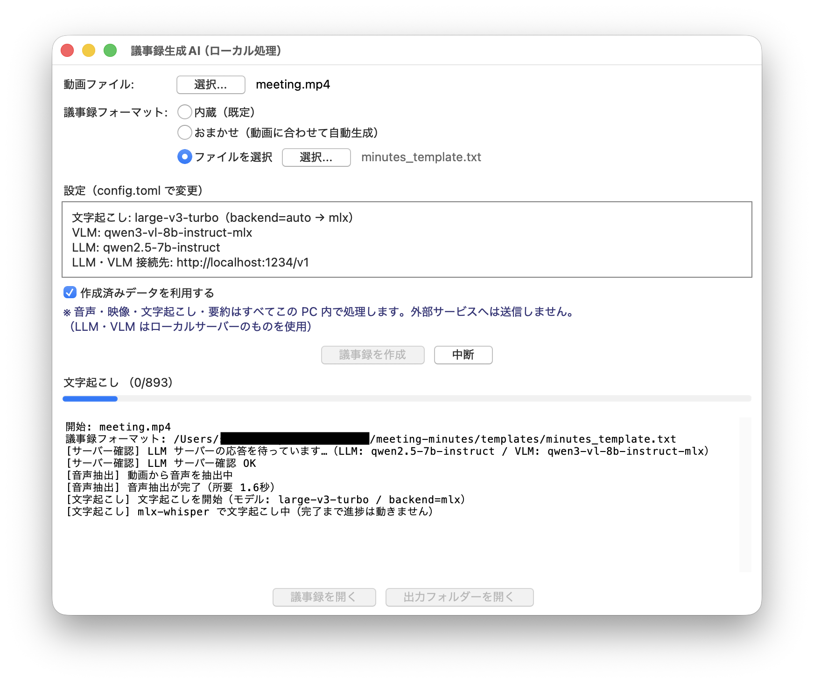
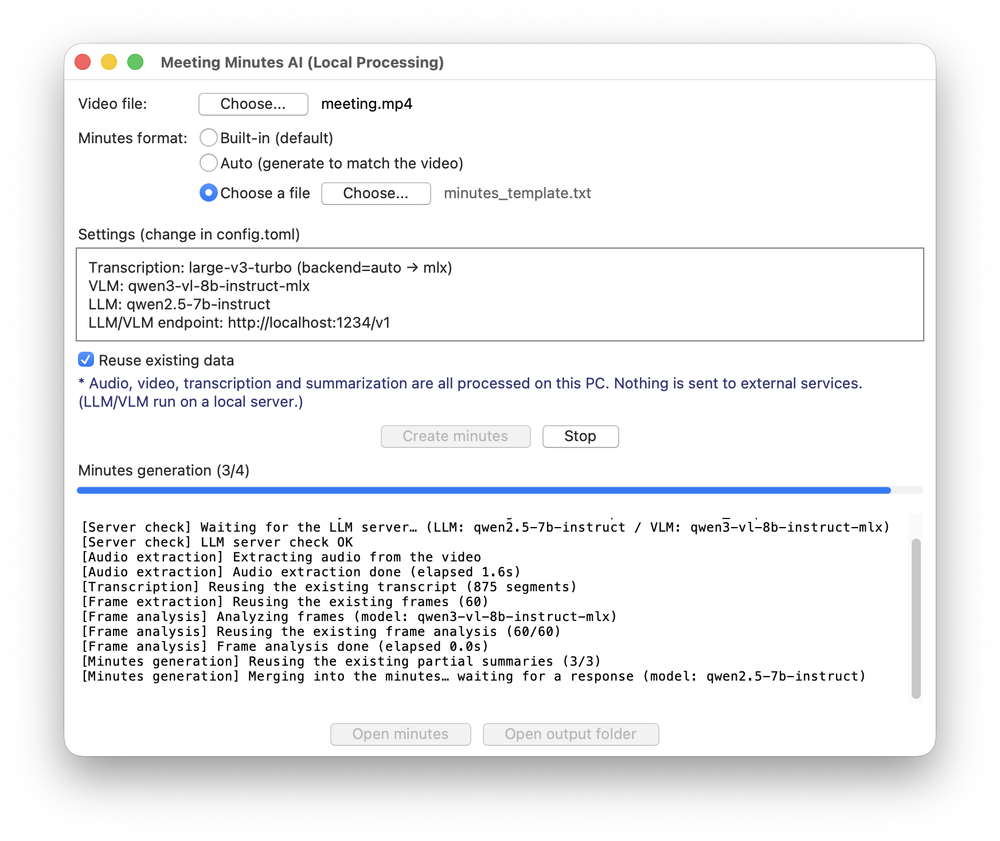
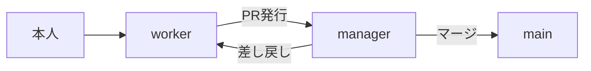

# meeting-minutes

[English](README_en.md) | 日本語

**打ち合わせの録画動画から議事録（Word・Markdown）を作成する。処理はすべて手元の PC で完結し、音声も文字起こしも要約も外部に送信しない。**

<!-- badges: CI バッジはフェーズ2で追加予定 -->

> 🧭 **要件・プロセスの設計判断は本人によるもの。** 主なもの:
>
> - **完全ローカル処理という制約** — 機密情報を外部送信しない要件を起点に設計した
> - **worker/manager の2セッション体制** — 実装担当とレビュー・マージ権限担当を
>   分離し、別ベンダー（Codex）の独立レビューを必須にした
> - **GUI の設計**
> - **「おまかせ」モード** — 動画内容に応じてLLMに見出し構成を提案させ、
>   気に入ればテンプレート化できる仕組み
> - **「中断」ボタンの要件** — 数十分かかる処理を安全に止められるようにする、という要件
> - **中間ファイル再利用の要件** — 文字起こし・フレーム抽出・フレーム解析・議事録要約を
>   個別に保存し、失敗・中断のたびに最初からやり直さない、という要件
>
> 実装は Claude Code の複数セッションが担当した。体制・レビュー基準は
> [開発体制（AI協調開発）](#開発体制ai協調開発)に明文化している。

---

## 背景

議事録の作成は AI による自動化に向いている。一方で、会議の音声や資料には
顧客情報や未公開の経営・人事情報が含まれることが多く、録音データをクラウドの
文字起こし・要約サービスへ送れない現場がある。主な制約:

- NDA
- 個人情報保護法
- GDPR
- 社内規程

## 概要

動画ファイルを 1 つ渡すと、次を **すべてローカルで** 実行して議事録を生成する CLI / GUI ツール。

1. 動画から音声を抽出（ffmpeg）
2. 時刻付きで文字起こし（Whisper）
3. 画面共有・スライドのフレームを抽出し、内容を要点化（VLM）
4. 文字起こし＋フレーム要点から議事録を生成（LLM）

- 外部ドメインへ接続するコードは無い。唯一の通信先は **自分で立てるローカル LLM サーバー**
  （[LM Studio](https://lmstudio.ai/) など）への `localhost` 呼び出しのみ
- モデルのダウンロードさえ済ませれば **Wi-Fi を切っても最後まで動く**
  （→ [`docs/privacy.md`](docs/privacy.md)）

出力は `output/<動画名>/` に:

```
output/<動画名>/
├─ transcript/
│   ├─ audio.wav              抽出した音声
│   ├─ transcript.json        時刻付き文字起こし（構造化）
│   └─ transcript.txt         時刻付き文字起こし（読みやすいテキスト）
├─ frames/
│   ├─ *.jpg                  抽出フレーム
│   ├─ frames.json            抽出フレームの索引（途中再開に使う）
│   └─ frame_notes.json       フレームごとの解析結果（途中再開に使う）
├─ work/
│   ├─ minutes_partials.json  議事録のチャンク要約（長い文字起こしの場合。途中再開に使う）
│   └─ structure_used.txt     「おまかせ」で自動生成した見出し構成（気に入ったら templates/ にコピー。下記）
├─ logs/
│   └─ gui.log                GUI のログ欄の書き出し（画面表示と同じ内容。追記）
├─ minutes.docx               議事録の Word 版（.md から自動生成）
└─ minutes.md                 議事録（決定事項・宿題/担当・期限などの型で整理）
```

本プロジェクトは、Claude Code の複数セッション（実装担当・レビュー担当）を
役割分担・レビュー体制つきで協調運用して開発した（→ [開発体制](#開発体制ai協調開発)）。

## GUI

<table>
<tr>
<td width="50%"><br>日本語版</td>
<td width="50%"><br>英語版（<code>--lang en</code> 起動）</td>
</tr>
</table>

1. 動画を選び「議事録を作成」を押す
2. 進捗バーとログを見ながら、文字起こし → フレーム解析 → 議事録生成の順に進む
3. カスタムテンプレート（「ファイルを選択」）にも対応

## セットアップ

macOS / Linux のクイックスタート（Windows は [`docs/setup.md`](docs/setup.md) を参照）:

```bash
brew install ffmpeg          # 音声・フレーム抽出に必要
bash scripts/setup.sh        # 仮想環境の作成・依存導入・文字起こしモデルの取得まで自動
cp config.example.toml config.toml
```

- `scripts/setup.sh` が仮想環境（`.venv`）作成・依存インストール・文字起こしモデル取得
  を 1 コマンドで行う。モデル取得はこのセットアップ時のみ（**アプリ実行は完全オフライン**。
  `cli.py` / `gui.py` が `HF_HUB_OFFLINE` を立て、モデル未取得なら自動DLせずエラーで停止）
- 別途 **LM Studio** を起動する（Settings → Local Models → Local Model API で
  「Local API server」を ON。「Just-in-time model loading」も ON 推奨）
- 議事録生成の LLM は **推論（thinking）をしない／オフにできる Instruct 系モデル** を選ぶ
  （推論モデルは極端に遅く、本文が空で返ることがある → [`docs/models.md`](docs/models.md)）
- 詳しい手順・モデル選び・トラブルシューティングは [`docs/setup.md`](docs/setup.md) と
  [`docs/models.md`](docs/models.md)

## 使い方

```bash
python src/meeting_minutes/gui.py                 # GUI: 動画を選んで「議事録を作成」。進捗バーとログ表示
python src/meeting_minutes/gui.py --lang en       # GUI の画面文言を英語で（既定は日本語）
python src/meeting_minutes/cli.py 打ち合わせ.mp4   # CLI: 動作確認・自動化用
```

- GUI の表示言語は `config.toml` の `[gui] language`（`"ja"` / `"en"`、既定 `"ja"`）でも
  指定できる。`--lang` はその回だけの上書き
- 切り替わるのは **GUI の画面文言だけ**。文字起こし言語・議事録の内容は別
  （`[transcribe] language` / LLM 側）

（開発者向けに `python -m meeting_minutes.gui` / `-m meeting_minutes.cli` も動く。
その場合は `cd src` するか `PYTHONPATH=src` を設定する。）

## 設定

`config.toml`（無ければ `config.example.toml` をコピーして作る）で調整。主な項目:

- `[ai] base_url` — ローカルサーバーの接続先（Ollama なら `http://localhost:11434/v1`）
- `[ai] llm_model` / `[ai] vlm_model` — ロード済みモデル名
- `[transcribe] backend` — `auto` / `mlx`（Apple GPU）/ `faster-whisper`
- `[transcribe] model` — 既定 `large-v3-turbo`（速い・高精度）/ `large-v3` / `medium` / `small`
- `[frames] interval_sec` / `scene_threshold` / `max_frames` — フレーム抽出の粒度と上限
- `[output] template_path` — 議事録の様式（見出し構成）を差し替えるカスタムテンプレート（下記）
- `[output] auto_structure` — `true` で「おまかせ」モード（動画内容に合わせて見出し構成を自動生成。下記）

各値は環境変数（`MM_AI_LLM_MODEL` など）でも上書き可能。

### 議事録フォーマット（見出し構成）を選ぶ

議事録の**構造**（見出し・項目）は 3 通りから選べる。**「捏造しない」等の品質ルールは
どれを選んでも常に適用される**（フォーマットはあくまで構造）。一発生成・分割生成の
どちらでも同じフォーマットが使われる。

| モード | 説明 |
| --- | --- |
| 内蔵（既定） | 会議の内容に関わらず常に同じ見出し（決定事項・宿題・議事の要点 …）。[`templates/minutes_template_example.txt`](templates/minutes_template_example.txt) と同一 |
| おまかせ | 動画の内容に合わせて見出し構成を LLM に毎回提案させる（例: 団体旅行の説明会 → 「スケジュール」「持ち物」「集合場所・時間」「注意事項」） |
| ファイルを選択 | お客様ごとの規定様式など、用意した外部ファイルの構造を使う |

- `config.toml` で既定を決める（優先順位 **`auto_structure=true` > `template_path` > 内蔵**）
- GUI の「議事録フォーマット」のラジオボタンから **その回だけ** 切り替えられる
  （3 択が排他。`config.toml` で `auto_structure=true` にしていても、GUI で「内蔵」「ファイルを選択」を選べばそちらが優先される）

#### おまかせ（動画に合わせて自動生成）

`config.toml` で `[output] auto_structure = true`、または GUI で「おまかせ」を選ぶ。

- 文字起こし（長い会議はチャンク要約）を材料に、**その会議に合った見出し構成だけ**を
  LLM が 1 回生成する。トークン予算に収まる範囲で行い、**議事録本文の生成に使う
  コンテキストは圧迫しない**（既存の分割要約を再利用し、全文を二度読ませない）
- 生成された構成は `{title}` 等をプレースホルダーのまま残した形で、出力フォルダーの
  **`work/structure_used.txt`** に保存される
- 生成に失敗した場合（LLM エラー・プレースホルダー欠落・構成が大きすぎて統合に
  収まらない等）は **内蔵にフォールバックし警告**する（`work/structure_used.txt` は残さない）

**気に入った構成を固定テンプレートにする**（毎回 LLM に生成させない分だけ速く、結果もぶれない）:

```sh
cp output/<動画名>/work/structure_used.txt templates/<客先名>.txt
```

として `config.toml` の `[output] template_path = "templates/<客先名>.txt"`（または GUI で
「ファイルを選択」）にすれば、以後はその構成に固定できる。

#### ファイルを選択（カスタムテンプレート）

お客様ごとの規定様式に合わせたいときに使う。

- `config.toml` の `[output] template_path` にパスを書くと、毎回そのファイルが使われる
- GUI では「ファイルを選択」→「選択...」でファイル指定。「内蔵（既定）」を選び直せばいつでも戻る
- ファイルが見つからない・読めない・空の場合は、**内蔵にフォールバックし警告**する

テンプレートで使えるプレースホルダー:

| プレースホルダー | 差し込まれる内容 |
| --- | --- |
| `{title}` | 動画ファイル名（拡張子なし） |
| `{datetime_hint}` | 日時のヒント（不明なら「（記載なし）」） |
| `{duration_hint}` | 記録時間のヒント（「約 N 分」等） |
| `{transcript}` | 文字起こし全文（**省略可**。テンプレートに書かなければ、その分だけ末尾に自動追加される） |
| `{frames}` | フレーム解析結果（時刻付き。**省略可**。`{transcript}` とは独立に、書かなかった方だけ補われる） |

雛形は [`templates/minutes_template_example.txt`](templates/minutes_template_example.txt)（内蔵と同一）。
これをコピーして見出しを書き換えるのが早い。

## 制限と注意点

| 項目 | メモ |
| --- | --- |
| 文字起こしの速度は環境依存 | マシン性能と、選ぶモデルサイズ・バックエンドで大きく変わる。選び方は [設定](#設定) を参照 |
| 文字起こしの精度には限界がある | 歌・BGM・拍手が多い区間は聞き取り違いが残りうる。重要な会議は文字起こしの目視確認を推奨 |
| 進捗表示の粒度はバックエンド依存 | 結果を逐次返さないバックエンドでは、進捗バーが止まって見え、完了時にまとめて進む |
| 話者の区別は付かない | 「誰が話したか」のラベルは付かない（`参加者` 表記） |
| 議事録生成は非推論モデル向け | 思考型（推論）モデルは極端に遅く、本文が空で返ることがある。Instruct 系の利用を推奨 |
| 中断・再開は工程の節目単位 | 中間ファイルを再利用し、やり直した分だけ再実行する（`--fresh` / GUI のチェックで無効化）。中断は実行中の工程が終わってから反応する |
| 設定変更は設定ファイルを直接編集 | GUI からは変更できない |
| LLM のタイムアウト・切断時の自動リトライは未対応 | 現状は再実行で復帰する |

> 💡 **動かすだけなら、ここまで読めば十分です。** この先は、パイプラインの内部設計
> （`pipeline.run` / `Deps` による分割）と AI 協調開発の運用フローの解説です。

## 仕組み

```
動画 ─▶ 音声抽出 ─▶ 文字起こし ─▶ フレーム抽出 ─▶ フレーム解析(VLM) ─▶ 議事録生成(LLM) ─▶ minutes.docx + minutes.md
       (ffmpeg)       (Whisper)       (ffmpeg)        (localhost)         (localhost)
```

- この順序・進捗通知・出力ディレクトリ管理は **`pipeline.run()` の中に集約されており**、
  GUI・CLI・テストはそれぞれ `run()` を呼び出して使う
- 各工程の実装は `pipeline.Deps` 経由で差し替えられる
  （詳細は [`docs/architecture.md`](docs/architecture.md)）

## 設計のポイント

- **1 つの継ぎ目（`pipeline.run` + `Deps`）** — UI と実処理を分離。ffmpeg も LLM も
  呼ばずに「工程順序・進捗・出力パス」をテストできる。
- **LLM/VLM を OpenAI 互換 API で抽象化** — `base_url` を差し替えると LM Studio /
  Ollama / 他に交換できる。`openai` パッケージには依存せず `httpx` 直叩き。
- **長い文字起こしの map-reduce** — 1 時間の会議はコンテキストに収まらないので、
  チャンク要約 → 統合の 2 段に切り替える。要約は `work/minutes_partials.json` に逐次保存し、
  再実行時は終わった分をやり直さない。
- **各工程の所要時間をログに表示** — 音声抽出・文字起こし・フレーム抽出・フレーム解析・
  チャンク要約・議事録統合の各完了メッセージに「所要 X」を添える。
- **フレーム解析も1枚単位で中間ファイル化** — `frames/frame_notes.json` を1枚終えるたびに
  書き直すので、途中で失敗しても解析済みのフレームはやり直さない。
- **LLM呼び出し中は「応答を待っています」を表示** — 文字起こし以外の待ち時間が
  読める工程（フレーム解析・議事録生成）では、使用モデル名とあわせて表示する。
- **文字起こしバックエンドを差し替え可能に** — `backend=auto` で Apple Silicon なら
  GPU を使う mlx-whisper、それ以外は faster-whisper。`config.toml` で固定もできる。
- **設定の多層化** — デフォルト < `config.toml` < 環境変数。TOML は標準 `tomllib` で依存ゼロ。

判断の理由とトレードオフは [`docs/DESIGN.md`](docs/DESIGN.md)。

## テスト

```bash
pip install -r requirements-dev.txt
pytest        # 17 本。ffmpeg 実行の統合テストを含む（ffmpeg / LLM が無い環境では自動 skip）
```

## 開発体制（AI協調開発）

本プロジェクトは、**役割を分けた 2 つの Claude Code セッション**（`claude` の独立した
プロセス）を協調させて実装した。LLM の出力を鵜呑みにせず、検証とガードレールを
組み合わせて確実性を担保する——いわゆる**ハーネスエンジニアリング**の考え方を、
開発プロセス自体にも適用している。



- **worker** — 実装・テスト・git 操作を担当するセッション
- **manager** — worker が発行した PR をレビューして `main` へマージするセッション。
  機密混入（実会議の固有名詞）・`.gitignore` の除外設定・差分が意図した範囲内か・
  破壊的操作の有無を確認した上でマージする
- 役割分担・禁止事項・レビュー基準は
  [`.claude/CLAUDE.md`](.claude/CLAUDE.md) に明文化（Claude Code がセッション開始時に
  自動で読み込む。実運用のセッションログなど他の `.claude/` 配下は非公開）
- **manager は worker の自己申告だけに頼らない** — 全 PR で pytest・機密混入チェックを
  manager 自身が再実行し、diff を直接確認した上でマージする
- **セッション間で会話コンテキストは共有されない** — manager は worker の試行錯誤の
  過程を見ず、最終的な diff と報告のみからレビューする
- **権限境界が働いた実例** — 追跡ファイルの削除など本人の直接確認が必要な操作では、
  worker は manager 経由の伝達だけでは実行せず、本人への確認を待って保留した実例がある
- **異なるベンダーのモデルによる独立レビューも組み込んだ** — Claude（manager）の判断に加え、
  OpenAI Codex（`codex exec review`）による独立コードレビューを全 PR のマージ前チェックに
  追加した
- **ループエンジニアリング** — 単発のレビューで終わらせず、実装 → 独立検証
  （pytest・機密混入チェック・diff 確認・Codex レビュー）→ 差し戻し → 修正 → 再検証を、
  全チェックがクリアになるまで繰り返す
- 差し戻しは具体的に行う — 該当箇所・再現条件・対処方針を添えて返す
  - 例: おまかせモード（Issue #34、PR #19 / #35）では、トークン予算まわりの不具合が
    6 件以上見つかり、往復のなかで修正した
  - 例: GUI の設定枠が実機で見えない問題は、PR #33 → #40 → #41 → #42 と
    4 回のやり直しを経て直した
- **同じ指摘が繰り返されたら運用ルール側を見直す** — 個々の PR を直すだけで終わらせない
  - 例: `.gitignore` の旧パス保護漏れが PR #48・#60・#66 で 3 回続いたため、以後
    「旧パスの ignore エントリを必ず残す」を方針として明記した

実会議データを扱うプロジェクトの性質上、push・PR前に追跡ファイルへの機密混入を
grep で確認する手順にしている。

## 問い合わせ

質問・不具合報告は [GitHub Issues](https://github.com/satoshi-abe-dev/meeting-minutes/issues) へ。
セキュリティに関する報告は [SECURITY.md](.github/SECURITY.md) を参照。

## ライセンス

MIT License。全文は [LICENSE](LICENSE) を参照。
